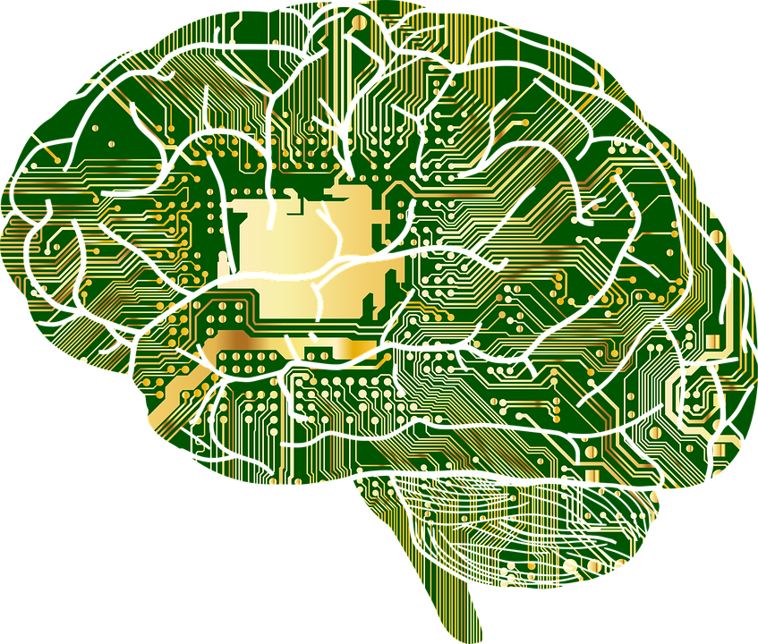

layout: true

<!-- 
layout slide is omitted from slideshow, and serves as default template for
subsequent slides 
-->

.logo[

]

.logo2[
<a href="http://stem.marlborough.org" target="_blank">
http://stem.marlborough.org
</a>
]

---

.center[
# What is AI   and   Why Should I Care?

 

Pushing Perspectives  
Computer Science Education Week  
_December 6, 2021_  

 
]

.center.purple[
Darren Kessner, PhD  
STEM+ Program Co-Head  
Math and Computer Science Instructor  
Marlborough School  
Darren.Kessner@marlborough.org  
]

---

## Artificial Intelligence

.center[

]

---

## Some math

---

.center[

  

### <a href="http://stem.marlborough.org" target="_blank">http://stem.marlborough.org</a>

]

