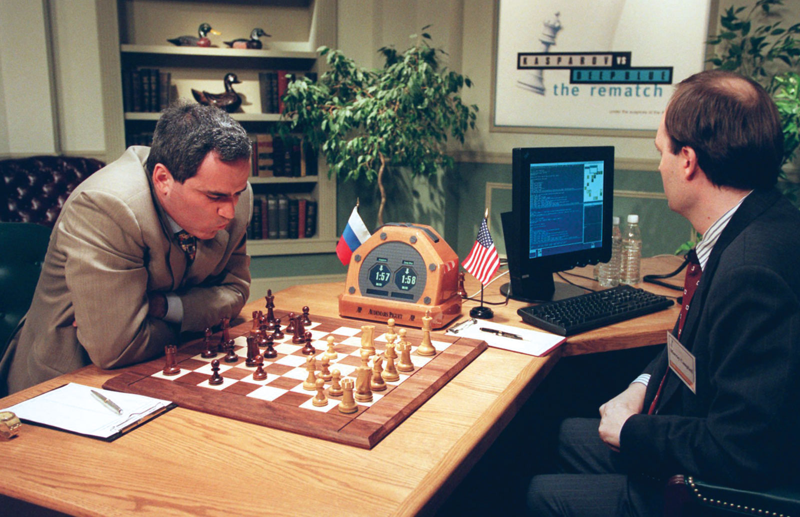

layout: true

<!-- 
layout slide is omitted from slideshow, and serves as default template for
subsequent slides 
-->

.logo[

]

.logo2[
<a href="http://stem.marlborough.org" target="_blank">
http://stem.marlborough.org
</a>
]

---

.center[
# What is AI   and   Why Should I Care?

 

Pushing Perspectives  
Computer Science Education Week  
_December 6, 2021_  

 
]

.center.purple[
Darren Kessner, PhD  
STEM+ Program Co-Head  
Math and Computer Science Instructor  
Marlborough School  
Darren.Kessner@marlborough.org  
]

---

## Artificial Intelligence

.center[

]

---

## Some math

---

## Application: Recommendation systems

 

- movie / video / music recommendations

.center[

]

 

- targeted ads

.center[

]

 

- extreme content / radicalization

.center[

]

---

## Application: Facial recognition

- automatic tagging of friends on social media
- identification of criminal suspects

.center[

]

- wrongful arrest
- surveillance of lawful gatherings

.center[

]

---

## Application: Pattern recognition

- optical character recognition
- spam filters
- fraud detection
- cancer detection
- exo-planet detection

.center[

]

- loan approval
- resume / job interview filters
- predictive policing
- weapon automatic target acquisition

.center[

]

---

## Application: Games and Robots

- chess, Go 
- flight simulator

.center[

]

- self-driving cars
- lethal autonomous robots

.center[

]

---

## Summary

* AI is not a __good__ or __bad__ technology

* AI is good at pattern recognition

* AI makes predictions based on historical patterns

---

.center[

  

### <a href="http://stem.marlborough.org" target="_blank">http://stem.marlborough.org</a>

]

