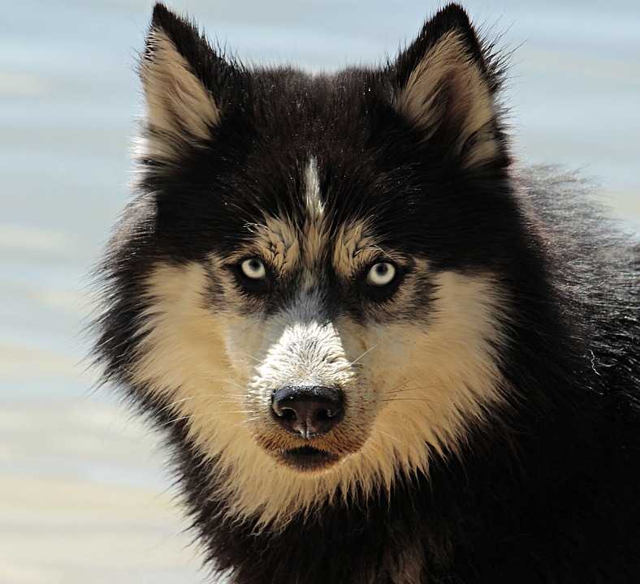

layout: true

<!-- 
layout slide is omitted from slideshow, and serves as default template for
subsequent slides 
-->

.logo[

]

.logo2[
<a href="http://stem.marlborough.org" target="_blank">
http://stem.marlborough.org
</a>
]

---

.center[
# What is AI   and   Why Should I Care?

 

Pushing Perspectives  
Computer Science Education Week  
_December 6, 2021_  

 
]

.center.purple[
Darren Kessner, PhD  
STEM+ Program Co-Head  
Math and Computer Science Instructor  
Marlborough School  
Darren.Kessner@marlborough.org  
]

---

## Artificial Intelligence

.center[

]

---

## Some math

.left-column40[

]

.right-column60[

Linear regression: 

- Find best fit line
    - equation y = mx + b
    - find parameters m, b that minimize error
    - _"train the model"_

- Make predictions
]

 

.left-column60[
Extensions:

- More dimensions
- More complicated functions
]

.right-column40[

]

---

## Application: Recommendation systems

 

- Movie / video / music recommendations

.center[

]

 

- Targeted ads

.center[

]

 

- Extreme content / radicalization

.center[

]

---

## Application: Facial recognition

- Automatic tagging of friends on social media
- Identification of criminal suspects

.center[

]

- Wrongful arrest
- Surveillance of lawful gatherings

.center[

]

---

## Application: Pattern recognition

- Optical character recognition
- Spam filters
- Fraud detection
- Cancer detection
- Exo-planet detection

.center[

]

- Loan approval
- Resume / job interview filters
- Predictive policing
- Weapon automatic target acquisition

.center[

]

---

## Application: Games and robots

- Chess, Go 
- Flight simulator

.center[

]

- Self-driving cars
- Lethal autonomous robots

.center[

]

---

## Summary

* AI is not a __good__ or __bad__ technology

* AI is good at pattern recognition

* AI makes predictions based on historical patterns

 
 

.left-column40[

]

.right-column60[

 

__Coding Workshop: Code your own AI program!__  

_Wednesday Dec 8 (Community Day)_  
_11:30am, SPARC D215_  

 

Presented by Code Violet, no coding experience necessary!

]

